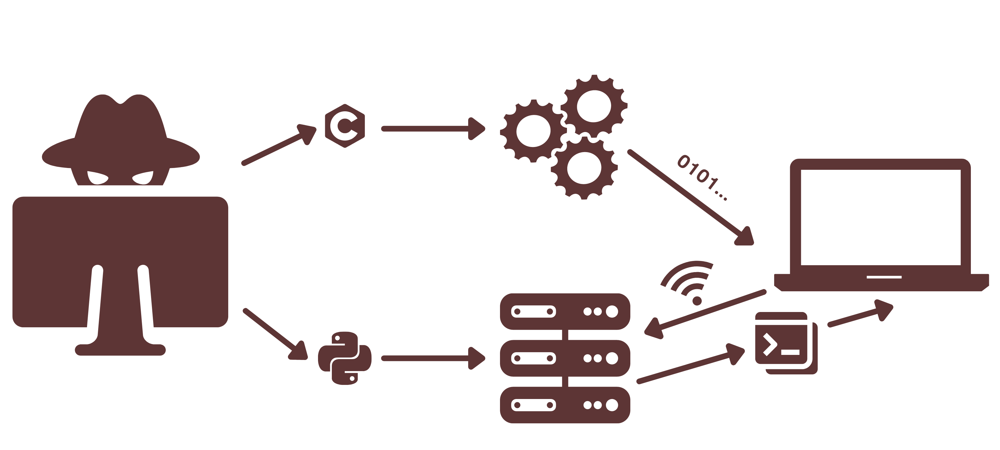

<p align="center"></p>

<p align="center">
  
</p>

<p align="center">
  
  
  
</p>

<p align="center">
  <a href="doc/README-es.md">Español</a>
</p>

## Table of contents
- [Table of contents](#table-of-contents)
- [Idea](#idea)
- [Installing](#installing)
  - [Prequisites](#prequisites)
  - [Compiling the Client](#compiling-the-client)
  - [Running the server](#running-the-server)
- [Legal advise](#legal-advice)
  - [License](#license)
  - [Warranty](#warranty)
  
<p align="center"></p>

## Idea
Trc is a Trojan horse created with the intention of having **full access to someone else's computer system**, accessing their cmd/terminal and being able to execute any command. 

To achieve this, a server programmed in Python is used that connects to a socket programmed in C from the client side.
<p align="center"></p>
<p align="center"></p>

## Installing

For using Trj, you will have to install two things, the client and the server. The client has been coded using C, as it can be compiled and the target of the attack will not notice that there is spyware running as a thread. The server is coded in Python. 
### Prequisites

| Name | Use | Links |
|------|-----|-------|
| Git  | Clonning the repository | [Install](https://git-scm.com/downloads) |
| Python (v3.6+) | Running the server | [Page](https://python.org) |
| C compiler (gcc) | Compiling the client | [Gnu](https://gcc.gnu.org/) |

The first step for installing trj is clonning the repository to your local machine:
```shell
git clone https://github.com/pblcc/trj
```

### Compiling the client
For compiling the client we use a C compiler as [gcc](https://gcc.gnu.org) and [CMake](https://cmake.org). Run the following commands:
```shell
cd client/
```
```shell
make
```
Now you can start the client as:
```
./client
```

### Running the server
To run the server you should use [Python](https://python.org). Run the following commands:
```shell
python server/server.py
```
###### NOTE: If you have multiple instalations of Python, use Python3

<p align="center">
  
</p>

 <p align="center"></p>

## Legal advice
Trc can be used for malicious purposes so we have to specify a couple of things.
### License
This project is under the BSL [License](LICENSE)
### Warranty
Use tcr **at your own risk**, I am not responsible for any unethical use you make with this repository. This repository has been programmed for educational use.
